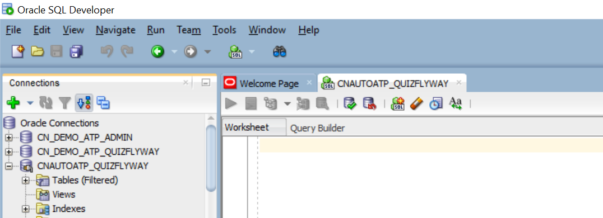
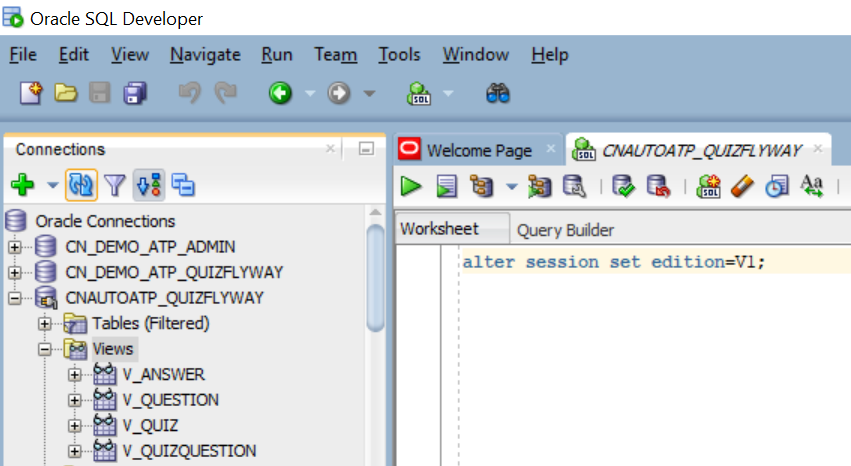
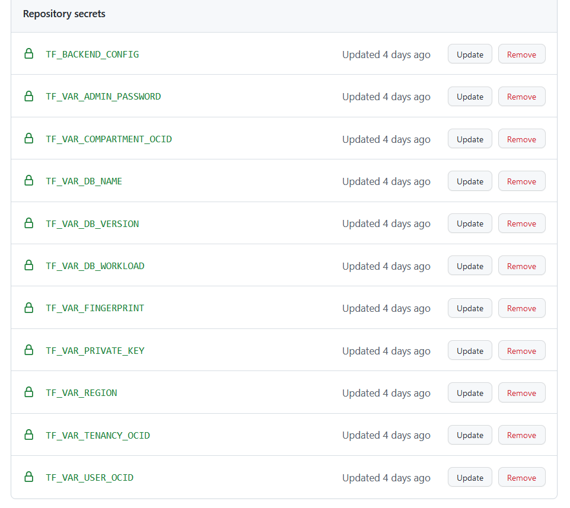
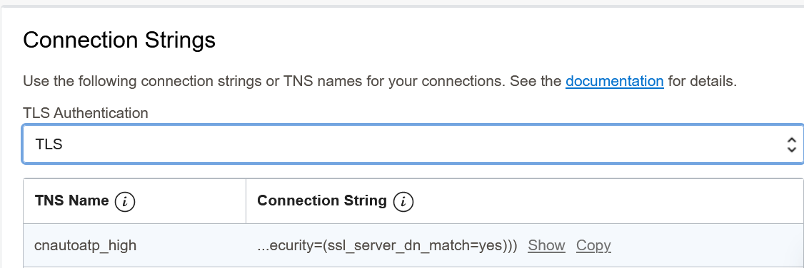
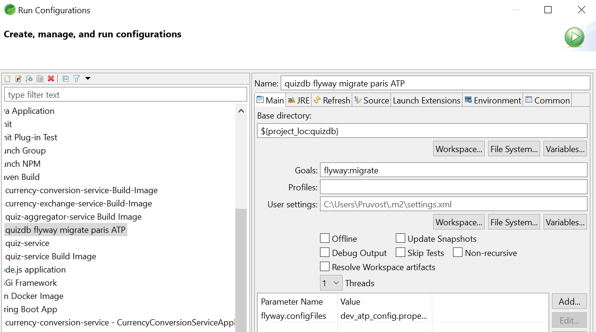

# Create an Oracle Autonomous Db with github (and version control your shema with Flyway) 

This workshop guides you through the setup, and the configuration of a Github Workflow in order to create/destroy an Autonomous Database and to version control your database schema with Flyway in a Microservices Architecture.

As a developer you just need to create a github issue with a title like "create-atp" in order to run the github workflow that will create the autonomous Database (with terraform) and create your database schema. In the same way you just need to create a github issue with a title like "destroy-atp" in order to run the github workflow that will destroy the autonomous Database (with terraform).    

First fork this project to do your own changes.

The structure of the project is :

- Flyway files in src\main\resources\db\migration
- Terraform files in src\main\resources\db\tf
- SQL Schema creation in src\main\resources\db\sql

## Part One : Flyway

You have 3 files describing 3 versions of the schema (V1, V1.1 and V1.2). The name of the schema is quizflyway.
Look at the files and you will see that the first line of each file starts with "ALTER SESSION SET EDITION = Vxxx;". We use Edition Based Redefinition (EBR), a feature of Oracle Db EE in order to version control the database.

After connecting to the database you see no view

Execute "alter session set edition=V1" then you see 4 views. Note that it is the same with PL/SQL procedures or functions.

It is magic you can have several version of the schema available at the same time !!! it means that a microservices application V1 can work with the schema in version V1 and at the same time the same microservices application V1.1 can work with the schema in version V1POINT1. 

## Part Two : SQL

Look at the SQL orders in order to understand how we create "Editions" in the database. Note that the paswword of the schema is "mypassword" because it will be replaced with the good password during the github workflow execution

## Part Three : Terraform 

First if you want to test the terraform files locally. You have to rename oci_adb_variables.auto.tfvars.template to oci_adb_variables.auto.tfvars and update the variables with the good values. Then you have to rename env-vars.ps1.template to env-vars.ps1 and update the variables with the good values. Execute on windows the file env-vars.ps1 in a powershell windows. If you use linux just adapt this file before running.

Secondly you need to create a Bucket (Object Storage) on OCI, store in it a terraform.state empty file, and create a pre-authenticated request. After that you can do a terraform init -reconfigure -backend-config="address=https://objectstorage.eu-frankfurt-1.oraclecloud.com/p/cnNvV.....xxxxxxxxx/n/oraseemeafrtech1/b/Minecraft/o/terraform.tfstate". Then do a terraform plan to check that all is ok.

At the end go to your github project and create all the needed secrets with the good values

Now on github You can create an issue "create-atp" that will trigger an ATP creation or create an issue "destroy-atp" that will trigger the ATP termination.

Note : There we do not use Mutual TLS connection with the ATP wallet.zip file. We use the TLS connection so no need to manage this boring wallet :o). We allowed a connection from everywhere with the CIDR ["0.0.0.0/0"] but it is just for the demo. Do not do that in production :o)

## Part Four : Run the Flyway migration.

Copy the prod_atp_config.properties to dev_atp_config.properties. Update the variables of the file with the good values.
The user is quizflyway
The password is the same passsword than the admin user (for simplicity)
The url is in the OCI interface

Then Run the maven flyway migration that will create all the schema ressources (tables, views, ..)

  

